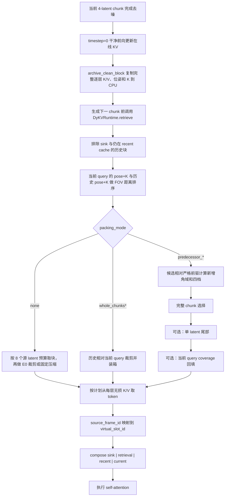

# dyKV 检索与旋转角度压缩全流程

## 1. 文档目的与当前结论

本文以当前 `minWM-dyKV` 代码为准，完整说明一个已经生成完毕的历史 KV chunk 如何经历
以下过程并重新进入注意力：

```text
干净 KV 归档 → 逐出候选过滤 → 当前 query FOV 排序
→ 历史 chunk 相对前驱 chunk 的旋转增量压缩
→ 8-slot 动态装箱 → 每层 K/V 实例化 → 三区域 RoPE rebase → 注意力
```

最重要的设计分离是：

- **检索回答“当前 query 应该取哪些历史”**。它比较当前正在生成的 4-latent query 与
  历史 chunk 的相机视场。
- **压缩回答“被取出的历史应该保留多少、保留哪一侧”**。推荐的 predecessor 路径比较
  候选历史 chunk 与其时间上严格相邻的前一个 chunk，而不是再次与 query 比较。

CPU 记忆库始终保存未压缩的完整 K/V。空间 token 只在某个历史块真正被检索并准备送入
注意力时裁剪，因此当前方法属于 **retrieval-time compression**，不是写入时压缩。

> **精度问题已修复，旧视频需要重跑：** 旧推理入口曾将 `viewmats/Ks` 转为 BF16，导致
> 纯 yaw 矩阵约 `1.5e-3` 的量化误差无法通过 `1e-4` 几何检查。当前版本让 dyKV 的权威
> 相机数据全程保持 FP32，仅在 PRoPE 算子内部把私有计算副本转换成 Q/K/V dtype。新增
> 回归测试已确认 `j*7` 进入 `predecessor_incremental_yaw` 的 `1/4` 档。不过，修复前生成的
> `predecessor_chunks` 视频日志仍全部是 `1/2` fallback，不能自动视为修复后的四档结果。

## 2. 术语、形状与固定预算

### 2.1 基本对象

| 名称 | 当前含义 |
| --- | --- |
| latent frame | VAE 时间轴上的一帧，不等于最终 MP4 的一帧 |
| chunk / block | 模型一次自回归生成的 4 个 latent frame |
| current query | 当前正在生成的 4-latent chunk 的 Q，以及对应的 4 组相机外参和内参 |
| historical block | 已完成干净前向并归档到 CPU 的完整 4-latent K/V |
| predecessor | 满足 `predecessor.frame_end == block.frame_start` 的严格相邻历史块 |
| frame segment | 一个源 latent 裁剪后留下的一段空间 token |
| virtual slot | retrieval 区域中用于 time-RoPE 的虚拟时间位置 4--11 |

“当前 query、相机 `K`”不是指用 Transformer 的 Q/K 内容做检索，也不是额外设置一个
`FOV=90°` 的公开超参数。它表示使用当前 query 四帧的相机位姿 `viewmats` 和归一化内参
矩阵 `K`，计算它们与历史相机视锥的几何重叠。

### 2.2 当前默认张量规模

Wan 2.1 推理 latent 的空间大小为 `60×104`，模型 patch size 为 `1×2×2`，所以每个
latent 对应：

```text
spatial grid = 30 × 52
tokens per latent = 30 × 52 = 1560
tokens per 4-latent chunk = 6240
```

裁剪只裁水平方向的 52 列；选中一列时保留该列全部 30 行。K 和 V 使用完全相同的 token
索引，所有 Transformer 层也复用同一份索引计划。

### 2.3 连续 `4 + 8 + 8` 布局

长时注意力使用固定的 20-latent 训练位置范围：

```text
0 ... 3          4 ........ 11          12 ... 15          16 ... 19
[ sink: 4 ]      [ retrieval: 8 ]       [ recent: 4 ]      [ current: 4 ]
```

- sink 永远是最初 4 帧；
- retrieval 的**物理 token 上限**等于 8 个完整 latent，即 `8×1560=12480`；
- local 共 8 帧，由 4 帧 recent 和当前 4 帧组成；
- 三个区域连续占满 20 个训练位置，没有中间空洞。

在线 GPU KV cache 物理保存 sink 4 和 local 8。历史 retrieval KV 平时只在 CPU bank 中，
检索时才搬到注意力设备。

## 3. 总体调用链



每个 current chunk 只规划一次 retrieval payload，后续同一 chunk 的多个去噪 step 复用该
payload，不会在每一层或每一步重新做 FOV 检索。

## 4. 相机输入：轨迹、外参与内参

### 4.1 外参

`Wan21/wan_utils/camera_trajectory.py::parse_trajectory` 先按动作字符串累计 C2W，再取逆得到
W2C `viewmats`。当前动作中：

- `j/l` 是绕相机 Y 轴的左右 yaw，基础步长为每 latent `3°`；
- `i/k` 是 pitch；
- `w/s/a/d/u/dn` 是平移；
- `n` 保持相机静止；
- `j@8*4` 表示把单步 `3°` 乘以 8，连续执行 4 次。

### 4.2 内参以及“只使用 intrinsics”的准确含义

当前推理入口 `Wan21/wan_inference.py` 为轨迹中的每一帧构造同一组归一化内参：

```text
K = [[0.5, 0,   0.5],
     [0,   0.5, 0.5],
     [0,   0,   1  ]]
```

由此得到水平和垂直 FOV 都是 `90°`：

```text
left   = atan(-cx / fx)          right  = atan((1-cx) / fx)
top    = atan(-cy / fy)          bottom = atan((1-cy) / fy)
```

固定角度 FOV case 和相应公开参数已经删除；检索器只接受 `K` 并由它推导视场边界。不过，
“从 `K` 推导”不等于当前已经读取每个 MBench 样本各自的真实标定：现有 CLI 路径为所有
生成样本构造上述同一个相机 `K`。如果以后数据提供真实或变化的内参，应从输入逐帧传入，
而不是继续在推理入口写死矩阵。

当前 query 缺少或包含非法 `K` 时，retrieval 直接报错；历史块缺少 `K` 时，该块不参与
FOV 排序。代码不会再退回一个独立的固定 FOV 角度。

## 5. 阶段一：完整干净 KV 的归档

### 5.1 为什么归档干净 KV

当前 chunk 的空间去噪完成后，pipeline 会用 `timestep=0` 或配置的 context noise 做一次
干净上下文前向。该前向把确定的 K/V 写入在线 cache。紧接着
`DyKVRuntime.archive` 调用 `DyKVBank.archive_clean_block`：

1. 从每个 Transformer 层在线 cache 的尾部切出本 chunk 的 `4×1560` 个 K/V；
2. `detach` 后复制到 `bank_device=cpu`；
3. 同时保存 `frame_start`、`frame_count=4`、`viewmats`、`Ks` 和 `spatial_shape=(30,52)`；
4. 为该块分配稳定的 `block_id`。

记忆库存的是每层完整 K/V，而不是只存第 0 层，也不是只存裁剪结果。第 0 层只在几何
裁剪不可用、需要内容 novelty mask 时负责计算一次共享 token 索引；索引随后应用于所有层。

### 5.2 为什么此处不压缩

写入时无法知道未来哪个 query 会检索该块，也无法知道后续实验采用哪种压缩参考系。保持
CPU bank 无损有三个好处：

- 同一历史块在不同 query 下可使用不同裁剪列；
- 不会因为一次错误裁剪永久丢失历史；
- `retrieval_no_compression`、固定 WorldKV、旧 E0 和 predecessor case 可以共享同一个
  归档生命周期。

## 6. 阶段二：逐出候选集合

生成下一个 chunk 前，`DyKVRuntime.retrieve` 首先判断：

```text
current_frame < 20  → 不启用 dyKV retrieval
current_frame ≥ 20  → 开始构造候选并检索
```

对于当前 4-latent chunk，local 8 中有 4 帧留给 current，因此候选过滤使用
`recent_frames = local_frames - chunk_frames = 4`。候选块必须满足：

```text
block.frame_start >= sink_frames
block.frame_end   <= current_frame - recent_frames
```

这会同时排除：

- `frame 0..3` 的固定 sink，避免它既作为 sink 又作为 retrieval 出现；
- 仍位于 recent cache 的历史帧，避免同一帧被重复加入注意力。

例如 chunk 大小为 4 时：

| `current_frame` | 最多可用历史块起点 | 候选数上限 |
| ---: | --- | ---: |
| 20 | `4, 8, 12` | 3 |
| 24 | `4, 8, 12, 16` | 4 |
| 40 | `4, 8, ..., 32` | 8 |

所以即使全部 chunk 都压到 `1/4`，也要到约 `current_frame=40` 才第一次具备装入 8 个
完整压缩 chunk 的历史数量条件。

## 7. 阶段三：由当前 Query 执行 FOV 检索

### 7.1 确定性三维探针

`DyKVRuntime` 初始化时调用 `deterministic_sphere_points`，生成 8192 个确定性的黄金角球体
探针，半径为 8。探针只生成一次，后续 retrieval 事件重复使用。相较随机蒙特卡洛采样，
它不会随视频生成 seed 改变检索得分。

对于一个当前相机 `C` 和历史相机 `H`：

```text
overlap(C,H)
  = 当前 FOV 与历史 FOV 同时包含的探针数 / 当前 FOV 包含的探针数

distance(C,H) = 1 - overlap(C,H)
```

历史相机半径 8 之外的探针不算作历史覆盖。距离越小，历史视角越接近当前 query。

### 7.2 Chunk 级距离

当前 query 有 4 帧。历史 4 帧块只取两个代表：第 0 帧和中间帧第 2 帧。每个 query 帧
分别与这两个代表计算 overlap 并取平均，再对 4 个 query 帧取平均：

```text
d(C_query, H_block)
  = mean_query_frames(
      1 - mean(history_first_overlap, history_mid_overlap)
    )
```

所有合法候选按以下顺序排序：

1. FOV distance 从小到大；
2. 同分时使用历史时间和稳定 block ID 做确定性决胜。

### 7.3 截断列表与完整排序列表

FOV 选择器同时返回：

- `selected`：按原始源帧预算最多选择 8 latent，即通常 2 个完整 4-latent chunk；
- `ranked_candidates + distances`：所有候选的完整 FOV 排名。

非扩容 case 使用 `selected`。`packed_chunks*` 和 `predecessor_*` 使用完整排名，让后续装箱
器依据压缩后的实际 token 成本选择超过两个历史 chunk。这一步是“压缩后能够扩大历史
覆盖”的关键，否则先截断两个 chunk，再压缩也无法取到更久的历史。

## 8. 阶段四：不同 Case 的压缩参考系

当前相关路径分为三类：

| 路径 | 历史选择依据 | 压缩依据 | 是否扩充历史 |
| --- | --- | --- | --- |
| `yaw_intrinsics` | 当前 query FOV | 历史相对当前 query 的可见交集 | 否，先限制为 8 源 latent |
| `packed_chunks*` | 当前 query FOV | 历史相对当前 query，量化到 `{1/4,1/2,1}` | 是 |
| `predecessor_*` | 当前 query FOV | 候选 chunk 相对严格前驱的新增角域，四档 | 是 |

因此，旧路径问的是“历史画面中哪些列现在仍可见”；predecessor 路径问的是“这个历史块
首次出现时，相比它前一个块新增了哪些列”。前者偏向当前相关性，后者偏向保存历史探索
过程中第一次出现的信息。`predecessor_query_backfill` 在最后用有限回填结合两者。

下文重点展开推荐的 predecessor 路径。

## 9. 阶段五：候选 Chunk 相对前驱的旋转增量压缩

### 9.1 查找严格前驱

对候选 `C_i=[s,s+4)`，`_find_predecessor` 在完整 CPU bank 中寻找：

```text
C_(i-1).frame_end == C_i.frame_start
```

前驱不需要自己也已经满足 retrieval 候选资格；它只作为计算 `C_i` 新增视角的参照。这样
候选 `frame 4..7` 仍可使用归档中的 `frame 0..3` 作为前驱，但 sink 本身不会被检索。

### 9.2 纯 yaw 条件

几何路径要求：

- 候选和前驱都具有完整 W2C 外参及合法 `K`；
- 空间形状与 1560 frame token 一致；
- 相机中心不发生可见平移；
- 相对旋转可以表示为绕 Y 轴的纯 yaw，不包含 pitch 或 roll。

实现以**前驱第 0 帧**为参考相机，分别计算前驱四帧和候选四帧相对该参考的 yaw。候选相对
前驱的有符号块级旋转量使用两组平均 yaw 之差，并归一化到 `[-π,π)`：

```text
signed_increment
  = wrap(mean(yaw(C_i)) - mean(yaw(C_(i-1))))
```

它主要用于确定没有显式新增区间时的裁剪方向和诊断；真正的保留比例来自下一节逐帧世界
角域的集合差。

### 9.3 从内参得到每列世界 ray

对于 latent 水平第 `x` 列，使用列中心的归一化坐标：

```text
u_x = (x + 0.5) / width
ray_x = atan((u_x - cx) / fx)
world_ray_x = frame_yaw + ray_x
```

相机的水平视角边界为：

```text
left  = atan((0-cx)/fx)
right = atan((1-cx)/fx)
H(frame) = [yaw + left, yaw + right]
```

这比简单使用“旋转角 / 固定 FOV”更准确，因为非中心主点、不同焦距和每帧不同内参都会
直接改变 ray 与边界。

### 9.4 前驱覆盖并集与新增角域

设候选第 `t` 帧的世界水平视场为 `H_i,t`，前驱四帧的并集为：

```text
P_i = union_k H_(i-1),k
N_i,t = H_i,t - P_i
r_i,t = width(N_i,t) / width(H_i,t)
```

计算集合差前，会把跨越 `±π` 的前驱 yaw 展开到离当前候选 yaw 最近的等价角度，因此
`179° → -179°` 不会被误认为旋转了 358°。

同一个完整 chunk 的档位取四帧最大新增比例：

```text
r_i = max_t r_i,t
```

这样四个 frame segment 使用同一档位，完整 chunk 的大小固定，便于作为一个整体进入
装箱器；P1/P2 的单 latent 尾部则可以使用各帧自己的 `r_i,t` 档位。

### 9.5 四档量化

量化严格使用左闭右开区间：

| 新增比例 `r` | 保留比例 `q` | 保留列数 | 每 frame token | 每 frame 原子数 |
| --- | ---: | ---: | ---: | ---: |
| `0 ≤ r < 1/4` | `1/4` | 13 | 390 | 1 |
| `1/4 ≤ r < 1/2` | `1/2` | 26 | 780 | 2 |
| `1/2 ≤ r < 3/4` | `3/4` | 39 | 1170 | 3 |
| `3/4 ≤ r ≤ 1` | `1` | 52 | 1560 | 4 |

这里的 `q` 是**保留比例**，不是删除比例。即 `q=1/4` 表示留下原 chunk 的四分之一空间
token。一个完整 4-latent chunk 若处于 `1/4` 档，总 token 为：

```text
4 frames × 390 tokens = 1560 tokens
```

正好等价于一个未压缩 latent 的 token 数。

### 9.6 根据旋转方向选择列

当 `r>0` 时，代码优先选取 world ray 落在新增区间 `N_i,t` 内的 latent 列。如果实际新增
列不足量化档位要求，再按列到新增区间边界的角距离向旧区域扩展，直到得到恰好
`q×52` 列。

这样：

- 左转和右转会自然选择相反侧的列；
- 方向来自外参和世界 ray，不依赖轨迹字符串是 `j` 还是 `l`；
- K/V 使用同一列 mask；
- 量化后的 chunk 只有四种固定大小，便于稳定装箱。

当 `r=0` 时，前驱已经覆盖当前候选全部水平角域，没有唯一“新增的一侧”。代码仍保留
`1/4` 安全下限，但不武断裁固定左侧或右侧，而是用第 0 层 K 计算层间共享的 novelty
mask：保留与该块第 0 帧 key 中心最不相似的 token。

### 9.7 非纯 yaw 的 fallback

若缺少严格前驱、相机几何不完整、发生平移/pitch/roll，或者纯 yaw 数值检查失败，P0--P2
不会根据角度裁剪，而是：

```text
每个源 latent 独立保留 50% novelty token
compression_mode = predecessor_fixed_novelty_fallback
```

注意它与 `fixed_novelty`/E0 的“完整 anchor + 后三帧 50%”不是同一种载荷。predecessor
fallback 的四帧全部为 50%，所以一个 chunk 等效占 2 个 latent，8-latent retrieval 最多
容纳 4 个 chunk。

如果候选连 `(30,52)` 空间形状都不具备，规划器无法建立原子化 token 索引，会直接跳过。

## 10. BF16 纯旋转误判及当前修复

### 10.1 问题路径

旧版 `Wan21/wan_inference.py` 曾将相机数据转换为：

```python
viewmats = ...to(device=device, dtype=torch.bfloat16)
Ks = ...to(device=device, dtype=torch.bfloat16)
```

归档后 `_single_batch_frames` 虽然再转成 FP64，但 BF16 量化时损失的旋转矩阵精度无法恢复。
`_pure_yaw_delta` 检查实际相对旋转与理想 yaw 矩阵的最大误差，默认容差为 `1e-4`。对当前
`j*49,l*49,n*1` 的纯旋转轨迹，实测一个 4-latent 间隔的矩阵误差约为：

```text
rotation_error ≈ 0.001499 > 0.0001
center_error   = 0
```

所以失败原因不是轨迹包含平移，而是 BF16 旋转矩阵无法通过过严的正交性检查。

### 10.2 对旧实验的影响

已有日志
`output/mbench_typical_4_predecessor/predecessor_chunks/dykv_summaries.jsonl` 显示：

```text
keep_tiers                      : 全部 0.5
compression_modes               : 全部 predecessor_fixed_novelty_fallback
观察到的最大 selected_block 数 : 4
```

这意味着这些旧视频验证了 CPU bank、FOV 排序、fallback、装箱、RoPE 和生成链路能够运行，
但**不能**作为四档旋转裁剪效果实验。旧的 `yaw_intrinsics` 和 `packed_chunks*` 也调用同一
纯 yaw 检查，因此实际视频同样需要检查 `compression_modes`，不能仅依据 case 名称断言
几何裁剪已发生。

### 10.3 当前修复方式

当前实现没有放宽 `_pure_yaw_delta` 的 `1e-4` 几何标准，而是修复精度来源：

1. `wan_inference.py` 使用 `make_camera_tensors(..., dtype=torch.float32)` 构造权威
   `viewmats/Ks`；
2. pipeline 切片、FOV 检索和 CPU bank 归档继续使用这些 FP32 张量；
3. `prope_qkv` 在算子入口只把局部 `viewmats/Ks` 副本转换为 Q/K/V dtype，因此 PRoPE
   保持原有 BF16 计算路径，不会反向污染 dyKV 几何数据；
4. 回归测试使用与推理入口相同的 `j*7` 轨迹和 `K`，确认候选没有 fallback，档位为
   `1/4`，模式为 `predecessor_incremental_yaw`；
5. 原有平移 fallback 测试继续通过，说明修复没有靠放宽容差把平移错误接纳为 yaw。

除单元测试外，修复后还使用真实 Action2V DMD checkpoint 完成了 24-latent 短闭环冒烟：

```text
trajectory                  = j*10,l*10,n*3
retrieval event             = current_frame 20
selected source starts      = [4,8,12]
compression modes           = 12/12 predecessor_incremental_yaw
keep tiers                  = 12/12 为 1/4
used atoms / atom budget    = 12 / 32
retrieved tokens per layer  = 4680
```

这证明 FP32 相机数据确实贯通到真实 checkpoint 的归档、检索、裁剪、装箱和 attention 路径，
不只是单元测试构造能够通过。输出位于临时目录
`/tmp/minwm_dykv_fp32_predecessor_smoke`，只作为实现验收，不登记为 MBench 质量指标。正式实验
仍必须从各自日志检查 `predecessor_incremental_yaw`、非空 `incremental_fov_ratios` 和预期
`keep_tiers`，并使用新目录重跑旧 BF16 产物。

## 11. 阶段六：8-slot 动态装箱

### 11.1 原子预算

每个 virtual slot 的容量是一个完整 latent：

```text
1 slot = 1560 tokens = 4 atoms
1 atom = 390 tokens = 13 columns × 30 rows
8 slots = 32 atoms = 12480 tokens
```

每个压缩 frame segment 的大小只能为 1、2、3、4 个原子。完整 4-frame chunk 的成本为：

| 统一档位 | 单 chunk 原子数 | 等效 latent 容量 | 全部同档时最多完整 chunk |
| ---: | ---: | ---: | ---: |
| `1/4` | `4×1=4` | 1 | 8 |
| `1/2` | `4×2=8` | 2 | 4 |
| `3/4` | `4×3=12` | 3 | 2，另剩 8 原子 |
| `1` | `4×4=16` | 4 | 2 |

所以“主要触发 `1/4` 时能否装入 8 个压缩 chunk”的答案是：**token 和 RoPE 预算都支持**。
前提是至少存在 8 个合法 evicted candidate、它们真的进入 `1/4` 几何档位，并且没有因
缺失几何回退到 `1/2`。

### 11.2 为什么不能只做普通总和背包

一个 `3/4` frame segment 是 3 个原子，两个这样的 segment 不能放进同一个 4-atom slot。
因此即使总原子数不超过 32，也可能无法分到 8 个实际 slot。

`_select_groups` 的动态规划状态不是单一的 `used_atoms`，而是 8 个槽载荷的排序多重集。
尝试加入一个 chunk 时，会把它的四个 segment 逐一放入状态；只有实际可分箱才保留该状态。
最终 `_assign_slots` 再通过确定性回溯给每个 segment 分配 `virtual_slot_id`。

### 11.3 选择效用

候选 chunk 的效用为：

```text
similarity = clamp(1 - FOV_distance, 0, 1)
utility = similarity × sqrt(keep_tier)
```

FOV 更接近当前 query 的块效用更高；保留率更高也提高效用，但使用平方根减弱“大块天然
占优”的程度。规划器在实际 slot 可行的前提下最大化总效用，同效用时使用确定性顺序。

### 11.4 P0、P1、P2 的区别

| Case | 完整 chunk | 单 latent 尾部 | Query coverage 回填 |
| --- | --- | --- | --- |
| `predecessor_chunks` | 是 | 否 | 否 |
| `predecessor_chunks_latent` | 是 | 是 | 否 |
| `predecessor_query_backfill` | 是 | 是 | 是 |

#### P0：完整 chunk

只选择能够整体放入的候选 chunk。四个 frame segment 都必须进入计划，否则整个 chunk 不选。

#### P1：单 latent 尾部

完整 chunk 选择完成后，从未被整体选中的候选中展开逐 frame 备选。每帧使用自己的新增
比例档位，在剩余槽容量中继续做精确选择。它解决“剩余空间不够一个完整 chunk，但仍能
放入若干历史 latent”的情况。

#### P2：当前 query coverage 回填

P2 先完成 P1，再对已经分配 slot 且具有几何列 mask 的 frame segment，重新计算它相对
当前 query 的可见列。若同一 slot 还有整 `1/4` 原子余量，就把尚未保留的 query 可见列
补入该 segment：

- 不改变它的 `source_frame_id` 和 `virtual_slot_id`；
- 不把一个源 frame 拆到多个时间位置；
- 不超过单槽 1560 token 和总计 12480 token；
- fallback segment 没有几何列信息，因此不会执行该回填。

如果 8 个 `1/4` 完整 chunk 已经使用全部 32 原子，就没有剩余空间执行 backfill，这是符合
预算设计的行为。

## 12. 阶段七：按层实例化 Retrieval K/V

装箱计划是 layer-shared 的。`materialize_packed_retrieval` 对每个 Transformer 层执行：

1. 根据计划中的 `block_index` 找到该层完整 K/V；
2. 用 `frame_offset×1560 + token_indices` 建立源 token 索引；
3. 将选中的该层 K/V 从 CPU 搬到目标设备；
4. 对 K 和 V 使用相同 `index_select`；
5. 按 virtual slot 和源帧顺序拼接 segment；
6. 附带 RoPE 和诊断所需的逐段元数据。

关键元数据包括：

```text
source_frame_ids       真实历史 latent 时间
frame_token_lengths    每段实际 token 数
virtual_slot_ids       目标 retrieval RoPE 位置
parent_block_ids       段来自哪个历史 block
selection_kinds        完整 chunk / tail latent
keep_tiers             四档或回填后的最终保留率
kept_columns_per_frame 实际列 mask
```

同一检索计划对所有层复用，但每层仍从自己的完整 K/V 中取值。正常几何路径不依赖第 0 层
内容；只有 novelty fallback 使用第 0 层计算共享索引。

## 13. 阶段八：三区域 RoPE Rebase

### 13.1 为什么需要 rebase

历史 K 在首次生成时已经带有真实源时间 `source_frame_id` 的时序 RoPE。如果直接把很久以前
的 K 拼到当前注意力，位置会超过 20 帧训练范围；若只修改元数据而不修改 K，K 内已有的
旋转也不会自动改变。

### 13.2 逐 segment 的时序平移

对一个已应用 RoPE 的 K segment，目标位置为 `virtual_slot_id`，代码只在 temporal RoPE
复数通道乘以差值对应的相位：

```text
delta = virtual_slot_id - source_frame_id
K_rebased = shift_roped_time(K_source, delta)
```

空间 height/width RoPE 通道保持不变，V 本身没有 RoPE，因此只按相同顺序拼接，不做相位
变换。输入会先复制，避免同一个 CPU K 在多次检索或多个去噪 step 中累积旋转。

### 13.3 多个源帧共享一个 slot

当 4 个 quarter frame segment 共享一个 slot 时，它们都映射到同一时序位置，但仍保留各自
原有的空间 RoPE。该 slot 表示“有序压缩记忆容器”，不是精确恢复真实历史时间间隔。

RoPE 组合函数强制检查：

- `virtual_slot_id` 位于 4--11；
- slot ID 已排序；
- 每个 segment 长度为整原子且不超过 1560；
- 同一 slot 的 segment token 总和不超过 1560；
- 全部 retrieval token 不超过 12480。

当前 query 的 Q 和 K 被映射到 16--19；recent 被映射到 12--15；sink 保持 0--3。最终送入
self-attention 的顺序为：

```text
sink K/V | retrieval K/V | recent+current K/V
```

minWM 的 PRoPE 分支当前仍只使用自己的 local cache，不加入 CPU retrieval bank。

## 14. 一个完整示例

假设在 `current_frame=40` 时有 8 个可用历史 chunk，FOV 排名后它们都被判断为：

```text
incremental_fov_ratio < 1/4
keep_tier = 1/4
```

则流程为：

1. 每个 chunk 四帧各保留 13 列，即 `4×390=1560` token；
2. 每个 chunk 总成本 4 atoms；
3. 8 个 chunk 总成本 `8×4=32 atoms`，恰好达到预算；
4. 32 个 quarter frame segment 被分到 8 个 slot，每个 slot 共 4 atoms；
5. CPU bank 中覆盖了 32 个源 latent，但实际 attention retrieval token 仍只有 8 个完整
   latent 的容量；
6. 每段根据自己的真实源时间 rebase 到 4--11；
7. P2 没有余量做 query backfill。

如果使用修复前的旧产物，或外部调用者预先把相机几何量化成 BF16，仍可能回退到 `1/2`：

1. 每个 chunk 成本变为 `4×2=8 atoms`；
2. 32 原子预算最多选择 4 个完整 chunk；
3. 覆盖 16 个源 latent，而不是理论上的 32 个。

## 15. 日志字段与判读方法

每个 prompt 的 `OUTPUT_FOLDER/dykv_summaries.jsonl` 包含所有 retrieval event。关键字段如下：

| 字段 | 如何解释 |
| --- | --- |
| `current_frame` | 当前正在生成 chunk 的起始 latent 时间 |
| `candidate_block_ids` | 通过 sink/recent 资格过滤的候选 |
| `ranked_candidate_block_ids` | 当前 query FOV 完整排序 |
| `selected_block_ids` | 最终作为完整 chunk 选中的块 |
| `selected_tail_frame_ids` | P1/P2 额外加入的单 latent |
| `distances` | 与完整 FOV 排名对齐的距离 |
| `compression_modes` | 是否真正执行几何裁剪或进入 fallback |
| `incremental_yaw_degrees` | 候选相对前驱的块级有符号 yaw 增量 |
| `incremental_fov_ratios` | 量化前逐 segment 新增角域比例 |
| `keep_tiers` | 量化档位；P2 回填后可能反映最终更大比例 |
| `source_frame_ids` | 每个 segment 的真实源时间 |
| `virtual_slot_ids` | 每个 segment 的目标 RoPE slot |
| `packing_used_atoms` | 已使用原子数 |
| `packing_budget_atoms` | 固定为 32 |
| `retrieved_tokens_per_layer` | 每层最终 retrieval token 数 |
| `query_backfill_tokens` | P2 为各段补回的 token 数 |

只看视频目录名或 case 名不足以证明几何路径发生。正式实验至少要同时确认：

```text
compression_modes 包含 predecessor_incremental_yaw
incremental_fov_ratios 不是 null
keep_tiers 与预期角度档位一致
packing_used_atoms <= 32
retrieved_tokens_per_layer <= 12480
```

可以在 `minwm-fa` 环境中用以下脚本快速汇总一个输出：

```bash
python - <<'PY'
import collections
import json
from pathlib import Path

path = Path("output/CASE/dykv_summaries.jsonl")
tiers = collections.Counter()
modes = collections.Counter()
max_chunks = 0
max_tokens = 0

for line in path.read_text(encoding="utf-8").splitlines():
    if not line.strip():
        continue
    row = json.loads(line)
    for event in row.get("summary", {}).get("events", []):
        tiers.update(map(str, event.get("keep_tiers", [])))
        modes.update(event.get("compression_modes", []))
        max_chunks = max(max_chunks, len(event.get("selected_block_ids", [])))
        max_tokens = max(max_tokens, event.get("retrieved_tokens_per_layer", 0))

print("tiers:", tiers)
print("modes:", modes)
print("max full chunks:", max_chunks)
print("max retrieval tokens/layer:", max_tokens)
PY
```

## 16. 推荐的对比关系

使用当前 FP32 几何版本重新生成后，核心对比如下：

| 对比 | 回答的问题 |
| --- | --- |
| `baseline` vs `retrieval_no_compression` | 长期检索本身是否有收益 |
| `retrieval_no_compression` vs `predecessor_query_backfill` | 压缩和扩容相对不压缩上界的质量/效率 |
| `yaw_intrinsics` vs `predecessor_chunks` | 当前-query 裁剪与前驱增量裁剪的差异 |
| `packed_chunks_latent` vs `predecessor_chunks_latent` | 在都允许历史扩容时比较两种压缩参考系 |
| `predecessor_chunks` vs `predecessor_chunks_latent` | 单 latent 尾部是否有效利用余量 |
| `predecessor_chunks_latent` vs `predecessor_query_backfill` | 当前 query coverage 回填是否减少错误遗忘 |

正式对比必须固定 prompt/MBench assignment、轨迹、checkpoint、latent 长度、分辨率、seed、
SP/GPU 数量和代码 commit，并使用全新输出目录，避免跳过已有视频改变后续样本的随机数消耗。

## 17. 当前边界与尚未实现的部分

- 前后、左右和上下平移目前没有 depth-aware 可见性模型，predecessor 路径走 50% novelty
  fallback；不能把平移距离直接当作像素裁剪比例。
- pitch/roll 也没有对应的纵向/二维裁剪档位。
- 当前推理入口为所有帧构造同一个 `90°×90°` 内参；尚未接入逐 MBench 样本真实标定。
- FOV 检索采用 8192 个有限半径探针，是几何近似而不是精确场景可见性或遮挡推理。
- 多个历史 frame 共享 virtual slot 会压缩真实时间关系，这是固定 20 帧训练 RoPE 范围下的
  明确折中。
- 修复前的 BF16 相机旧视频仍是 fallback 结果；必须在新输出目录重新生成并检查日志。
- 单元测试证明算法和预算契约，不等于真实 checkpoint 视频质量或 MBench 指标已经完成。

## 18. 代码索引

| 文件 | 关键职责 |
| --- | --- |
| `Wan21/wan_inference.py` | 解析轨迹、构造相机 K、选择 case、保存生成和 dyKV 日志 |
| `Wan21/pipeline/causal_inference.py` | 每 chunk 检索一次、去噪、干净前向、归档 |
| `Wan21/pipeline/causal_diffusion_inference.py` | CFG/多步路径的正负分支检索与归档 |
| `Wan21/pipeline/dykv_memory.py` | 配置验证、CPU bank、逐出资格、E0 裁剪和固定 novelty |
| `Wan21/pipeline/dykv_fov.py` | 确定性探针、视锥 overlap、chunk FOV 距离和完整排序 |
| `Wan21/pipeline/dykv_predecessor.py` | 严格前驱、新增角域、四档量化、精确分箱、tail、backfill |
| `Wan21/pipeline/dykv_packing.py` | 通用原子定义、旧 packed 路径、逐层 materialize 和元数据 |
| `Wan21/pipeline/dykv_runtime.py` | 串联候选、检索、case 路由、规划、实例化和事件记录 |
| `Wan21/wan/modules/dykv_rope.py` | query/local/retrieval 的有界 time-RoPE rebase 与不变量检查 |
| `Wan21/wan/modules/causal_model.py` | 组合三区域 K/V 并执行 self-attention |
| `Wan21/dykv_cases.py` | 十二个可运行 case 的整体注册表 |
